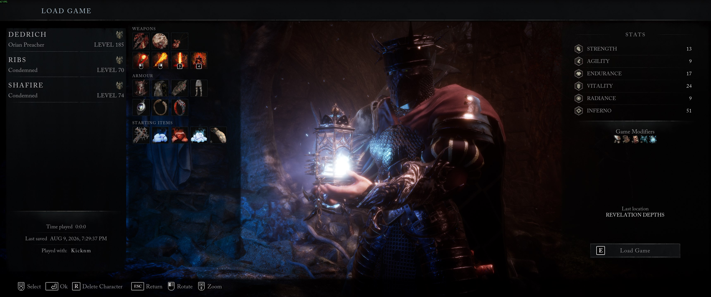
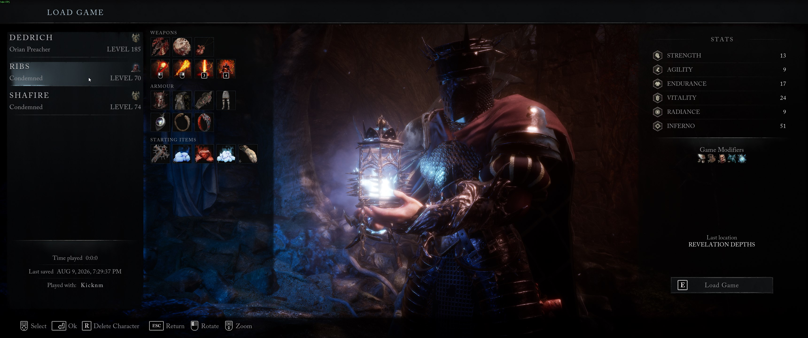

# LOTF2 Difficulty Fix

**Fix Veteran / Legacy difficulty on an existing *Lords of the Fallen* (2023) character — without starting over.**

Simple Windows app. One portable EXE. No install. No command line.

---

## What this is for

You made a character on **Veteran** (or you want it on Veteran), and the game is treating the save as **Legacy / Normal** instead.

- The load menu icon is wrong  
- Enemies feel easier than they should  
- You already put hours into the run and don’t want a new character  

This tool opens your save, sets the difficulty flag, and **always makes a backup first**.

---

## Before & after

| Before (broken / Legacy) | After (Veteran fixed) |
|:------------------------:|:---------------------:|
|  |  |

*Same character (Ribs). Load screen icon / difficulty corrected after the fix.*

---

## Download

Grab the latest **`LOTF2_Difficulty_Fix.exe`** from:

### 👉 [Releases — download the EXE](https://github.com/Dedrich/lotf2-difficulty-fix-gui/releases/latest)

That’s the whole app. Put it on your desktop, in Downloads, wherever — it’s portable.

---

## How to use (gamer steps)

1. **Quit Lords of the Fallen completely**  
   Not just to the menu — fully close it (and wait a few seconds).

2. **Run `LOTF2_Difficulty_Fix.exe`**  
   Windows may warn about an unknown app the first time (unsigned community tool).  
   *More info → Run anyway* if you trust the download from this repo.

3. **Check the save folder**  
   It usually finds this automatically:

   ```text
   C:\Users\<You>\AppData\Local\LOTF2\Saved\SaveGames
   ```

   If the list is empty, hit **Browse…** and pick that folder, then **Refresh list**.

4. **Click your character** in the list  
   (Ctrl+click if you want more than one.)

5. **Pick difficulty**  
   - **Veteran (harder)** — what most people want  
   - **Legacy / Normal** — if you want to switch the other way  

6. Hit the big green button:  
   **▶ APPLY FIX TO SELECTED CHARACTER(S)**  
   (Or **double-click** a character.)

7. Confirm. Wait for the success message.

8. **Start the game → Load Game**  
   Check the difficulty icon next to your character.

9. **Load in, rest at a vestige** once so the game rewrites the save cleanly.

---

## Steam Cloud (important)

If the difficulty **snaps back** after you fix it, Steam Cloud probably re-downloaded the old file.

**Easy fix:**

1. Apply the tool again with the game closed  
2. Launch the game **offline** (or turn Cloud off for LOTF once)  
3. Load the character, rest at a vestige  
4. Quit, go online / re-enable Cloud  

Your fixed save should then upload as the new “truth.”

---

## Backups (you’re safe)

Every time you apply a fix, the original files are copied first to:

```text
%LOCALAPPDATA%\LOTF2\Saved\SaveGames\_difficulty_fix_backups\
```

In the app, use **Open backups folder**.  
To undo: quit the game, copy a `.bak_…` file back over the matching `.sav` name.

---

## FAQ

**Do I need Python?**  
No — only the EXE.

**Does this give me items / god mode?**  
No. It only sets the **difficulty mode** flag (Veteran vs Legacy).

**Will I get banned?**  
This is a single-player save edit. It’s an unofficial community tool — use common sense, and don’t use it if you’re uncomfortable.

**Character missing after a bad edit?**  
Restore from `_difficulty_fix_backups` (or your own backup). Always quit the game before running the tool.

**Still shows Legacy after fix?**  
1) Confirm you selected the right slot  
2) Check Steam Cloud (section above)  
3) Make sure you used the **latest release** EXE  

**CLI / nerdy version?**  
Same engine, terminal UI: [lotf2-difficulty-fix](https://github.com/Dedrich/lotf2-difficulty-fix)

---

## Disclaimer

Unofficial tool. **Not affiliated with CI Games or HEXWORKS.**  
Editing saves can go wrong if the game is running or Cloud fights you — that’s why backups are automatic. **Use at your own risk.**

---

## For people who want to build from source

You don’t need this if you only want the EXE.

```bat
git clone https://github.com/Dedrich/lotf2-difficulty-fix-gui.git
cd lotf2-difficulty-fix-gui
build_exe.bat
```

Output: `dist\LOTF2_Difficulty_Fix.exe`  
Requires Windows + Python 3.10+.

Run without packaging:

```bat
python app.py
```

---

## License

MIT — see [LICENSE](LICENSE).
